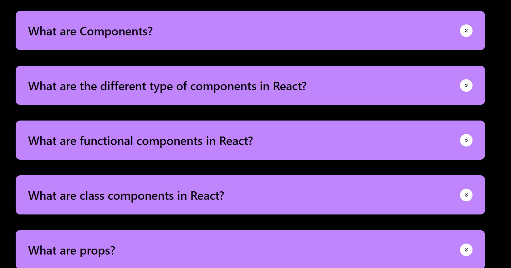
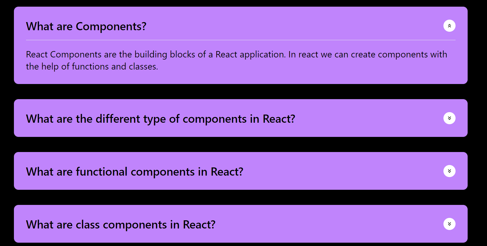
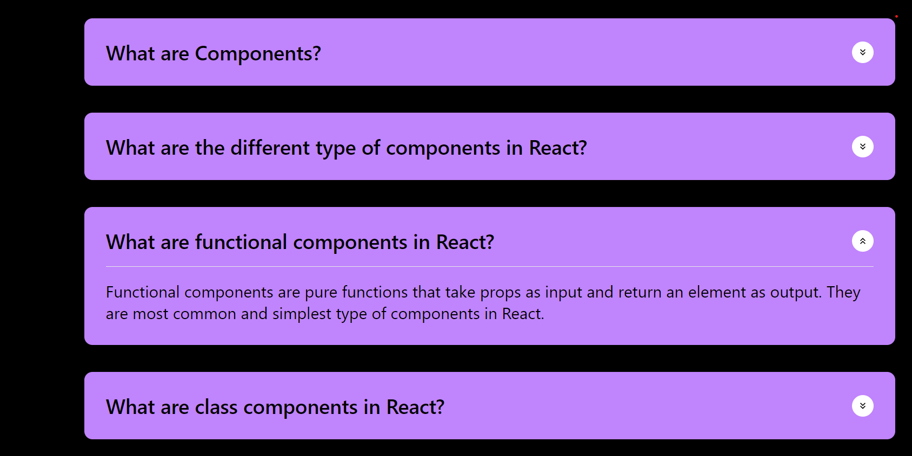

# React + Vite

# Question and Answer App

A simple React app that displays a list of questions and answers.

## About

This app allows users to view a list of questions and their corresponding answers.

## Features

- Display a list of questions and answers
- Click on the dropdowm arrow to reveal the answer of the corresponding question

## Getting Started

1. Install dependencies: `npm install`
2. Run the development server: `npm run dev`
3. Access the app in a web browser: `http://localhost:5173`

## Technologies Used

- React
- JavaScript
- Tailwind CSS

# Question List Component

A React component that displays a list of questions.

## Description

The 'QuestionList' component maps over the 'data' array and renders a 'Question' component for each item.
The console.log(data) statement is used for debugging purposes.

### Screenshot
.
.
.

